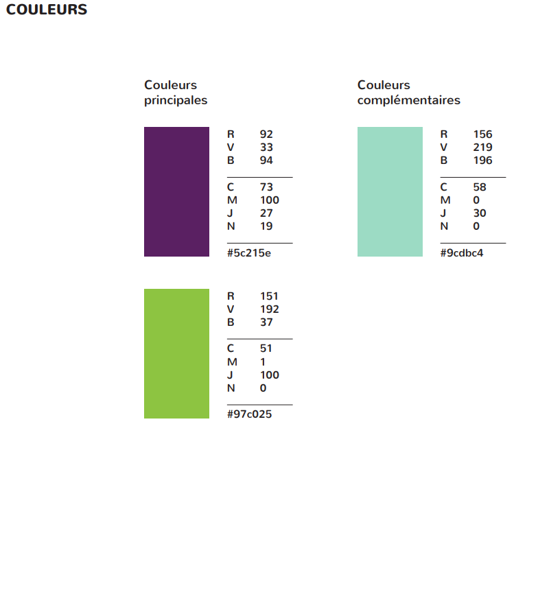

# Retravailler.re
 
# Projet Final

#### Coder et déployer une application web simple

## Introduction

Retravailler est une structure nationale, qui possède déjà un site internet. Nous souhaitons donc que l’antenne de Retravailler – La Réunion possède son propre site internet, afin de regrouper les offres de service que nous proposons sur le territoire.   

Il s’agit de développer un site mettant en avant les activités de l'association ici à la Réunion afin d’accentuer sa visibilité de dans le territoire et de développer sa notoriété.

## Objectif

Nous voulons une application web qui permette à des particuliers de s’inscrire aux différents ateliers  prestations que nous proposons.

Nous voulons tester la viabilité de l’application, c’est pourquoi nous voulons une application simple dans un premier temps.

## Cibles

Nos cibles sont des personnes à la recherche d'un emploi ou en reconversion professionnelle.

## Utilisateurs

Nous avons identifié 2 types d’utilisateurs.

#### Administrateur

L'administrateur peut vérifier les inscrits aux différents ateliers, en créér de nouveaux, les modifier ou les supprimer.
Il est défini par un identifiant, un mot de passe et une adresse mail.

#### Particulier

Le particulier peut créer un compte sur le site.
Après connexion à son compte, il peut choisir une prestation et s’inscrire à une date d'un atelier lié à celle-ci.
L'utilisateur ne peut pas s'inscrire à plusieurs dates du même atelier.

## Les prestations

Nous avons actuellement 3 offres de service proposant des ateliers :

Le Conseil en Evolution Professionnelle
AccèleR’Emploi
Atelier conseil 

## Les ateliers

Chaque ateliers possède les champs suivants :

- un titre
- une description du contenu de l’atelier
- une ou plusieurs dates
- le nombre de places liés à une date
Ces champs sont tous obligatoires lors de la création d'un atelier par l'administrateur.

## Les fonctionnalités
## User Stories 

| En tant que    | je veux                      | afin de                                           | Critère                                         |                  
| :--------------| :----------------------------| :-------------------------------------------------| :------------------------------------------------------------|
|  ADMINISTRATEUR   | désactiver/activer           | Rendre visible ou invisible pour les particuliers |- Désactiver l'atelier ne rend plus visible sur la liste des ateliers  - Activer l’atelier le rend visible sur la liste des ateliers |
|   ADMINISTRATEUR    |modifier un atelier           |changer les informations rentrées précédemment     |Les modifications apparaissent dans la liste des ateliers      |
|   ADMINISTRATEUR    | créer un atelier             |proposer à des particuliers                        |L’atelier nouvellement créé apparaît dans la liste des ateliers|
|   ADMINISTRATEUR   |avoir une interface d’administration sécurisé|être le seul à pouvoir modifier mes ateliers|L'utilisateur accède aux pages sécurisées grâce à un login et mot de passe.|
|  PARTICULIER   |voir la liste des ateliers    |s’inscrire à un atelier                            |une page qui affiche la liste des ateliers disponibles         |
|  PARTICULIER   |m’inscrire à un atelier       |de réserver ma place     |quand un particulier s’inscrit à l’atelier le nombre de places disponibles diminue|

## Charte graphique

### Notre logo

### Couleurs

Les couleurs de notre charte graphique sont :

### Les polices

Les textes utilisent la police Roboto.

### Design

Reprise du site original retravailler.org

## Périmètre

L’application doit :

- fonctionner en ligne
- afficher correctement sur plusieurs navigateurs récents (Edge, Chrome, Firefox)
- respecter les normes du W3C
- être responsive

## Wireframe

https://www.figma.com/file/8RBqhXedE9nQOmToRk6Iau/Retravailler.re?node-id=8%3A0

